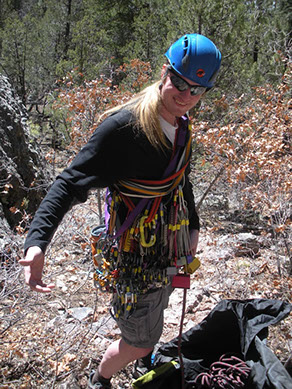
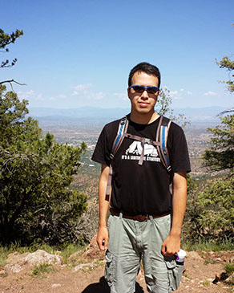
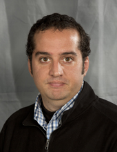
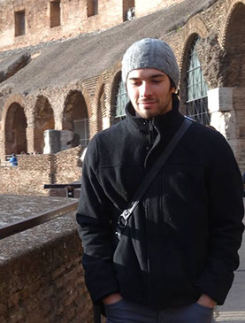
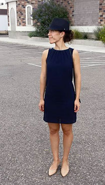
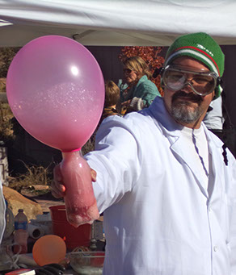
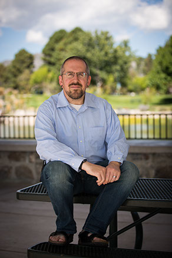
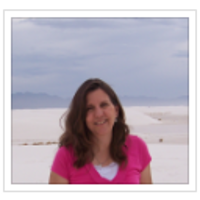
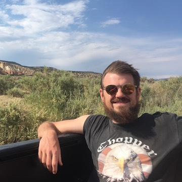

# Summer School Leads

### Christoph Junghans

CCS-7 Applied Computer Science

 Christoph is a computational physicist with a background in molecular dynamics and multi-scale physics applications. He also has experience in software engineering and task-based run-time systems. His interests lie in understanding modern computing architectures and the design of sustainable code.

### Robert Pavel

CCS-7 Applied Computer Science

Nicholas C. Metropolis Fellow

Robert is a computational scientist with a background in electrical and computer engineering. He has experience in improving the performance of multi-scale physics applications through the use of task based models and NoSQL databases. His interests include evaluating the suitability of modern task based programming models with respect to scientific applications.

Robert is an alumnus of the 2013 and 2014 summer school classes!

# Summer School Mentors

### Danny Perez

 T-1 Physics and Chemistry of Materials

Danny is a computational physicist with a background in molecular dynamics and multiscale modeling. His current research interests revolve around the development of novel methods that allow for atomistic simulations over very long timescales, their implementation in high performance computer codes, `and their applications to various problems in materials for energy or in nanotechnology.

### Rick Zamora

   
 T-1 Physics and Chemistry of Materials

Rick is a computational scientist with a background in failure mechanics and multi-scale material modeling. While at LANL, he has developed an expertise in parallel accelerated molecular dynamics methods. He enjoys working at the interface between numerical methods and materials applications, and is interested in developing new algorithms to leverage exascale machines.

### Irina Demeshko

CCS-7 Applied Computer Science

Irina is a computational scientist the Co-Design Team. Her current research work is currently focused on integrating task-based run-time systems into several software projects at LANL, but, in general, her research interests lay around new HPC technologies in application to large-scale scientific simulation codes.

### Blas Uberuaga

MST-8 Materials Science in Radiation and Dynamics Extremes

Blas Uberuaga is a physicist/computational materials scientist who focuses on radiation damage effects in materials for nuclear energy applications. His particular areas of interests include complex oxides and nanostructured materials. He is an expert in the application of accelerated molecular dynamics methods to study defect kinetics in complex materials to provide the foundations for understanding materials performance.

Blas is a team leader in MST-8 and leads both internal LANL and DOE projects on the properties of complex materials.

### Geoff Womeldorff

CCS-7 Applied Computer Science

Geoff is a compuational scientist with a background in mathematics and centroidal Voronoi tessellations. He has experience in numerical methods and parallel frameworks for multi-scale models for ocean, and algorithms for communication aggregation, thereof. His interests also include the coupling between proxy applications, their hosts, and programming models, codesign interactions, and parallel frameworks and algorithms, in general.

### Patricia (Pat) Grubel

CCS-7 Applied Computer Science

Pat is a postdoctoral research associate in the Co-design Team. She has a background in electrical and computer engineering, future architectures, performance analysis of task basked runtime systems.  Her current interests lie in modeling and performance optimization of applications using task based systems, cloud computing technologies, and benchmarking new architectures.

### Tom Swinburne

 T-1 Physics and Chemistry of Materials

Tom is a physicist trained to be a theoretical materials scientist, using mathematical and computational methods to understand thermally driven microstructure evolution. He working on the development of accelerated molecular dynamics techniques and Markov models at LANL.
