<h1> Summer School Leads </h1>

### Julien Loiseau

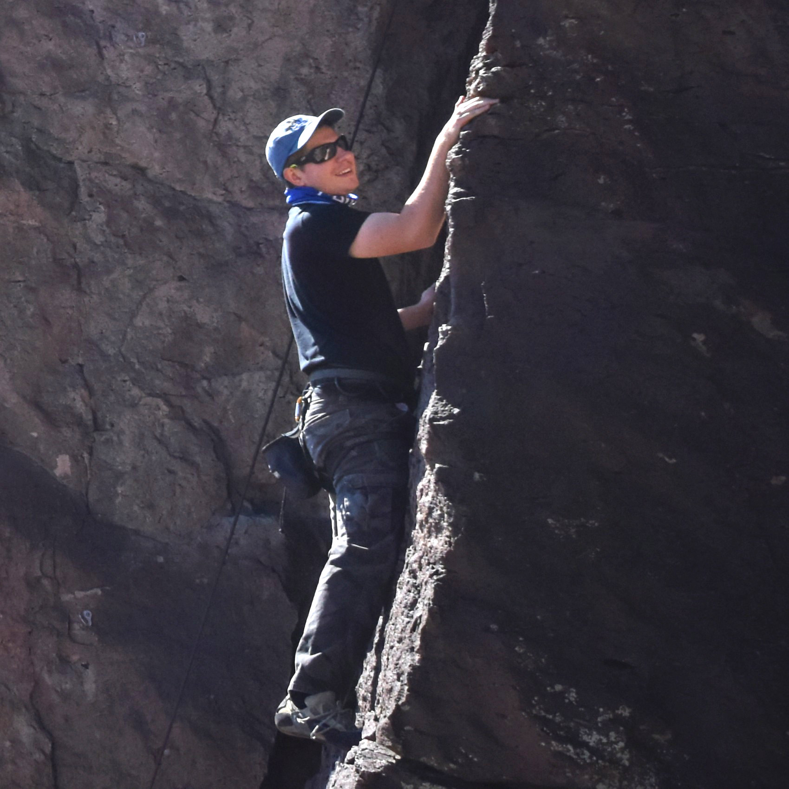

CCS-7 Applied Computer Science. 

Julien is a Computer Scientist with a background in High Performance Computing and simulation. He has experience in hybrid architectures and accelerated systems.  His postdoctorate work focuses on FleCSPH, a tool for Smoothed Particles Hydrodynamics simulations based on the FleCSI framework from LANL.  The intent is to provide an efficient and distributed tree data structure to FleCSI that allows the work to be offloaded to accelerators. The final goal of FleCSPH is to simulate large Astrophysics events.  

Julien is an alumnus of the 2016 summer school class.

### Hyun Lim

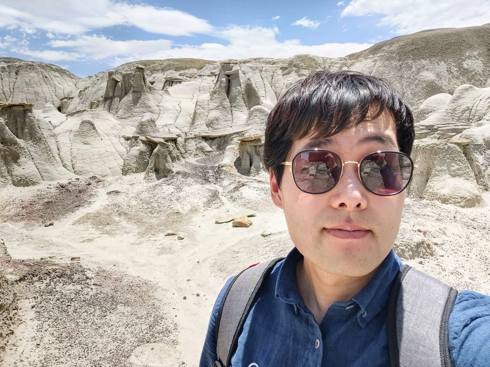

CCS-2 Computational Physics and Methods.  

Hyun Lim is a staff scientist in CCS-2 with a background gravitational physics, astrophysics, and applied mathematics. He has experiences developing various multi-physics codes both Eulerian and Lagrangian frames to solve problems in astrophysics and magnetohydrodynamics. He also works on scalable numerical methods including adaptive mesh refinement and linear solvers.  

Hyun Lim is an alumnus of the 2016 summer school class.

<h1> 2023 Summer School Mentors </h1>

### Robert Pavel

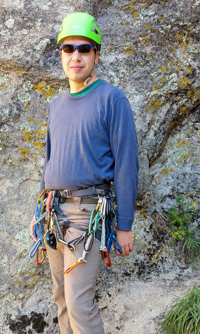

CCS-7 Applied Computer Science.  

Robert is a computational scientist with a background in electrical and computer engineering. He has experience in improving the performance of multi-scale physics applications through the use of task based models and NoSQL databases. His interests include evaluating the suitability of modern task based programming models with respect to scientific applications.  

Robert is an alumnus of the 2013 and 2014 summer school classes. He is also one of the previous leads of the summer school.

### Karen Tsai

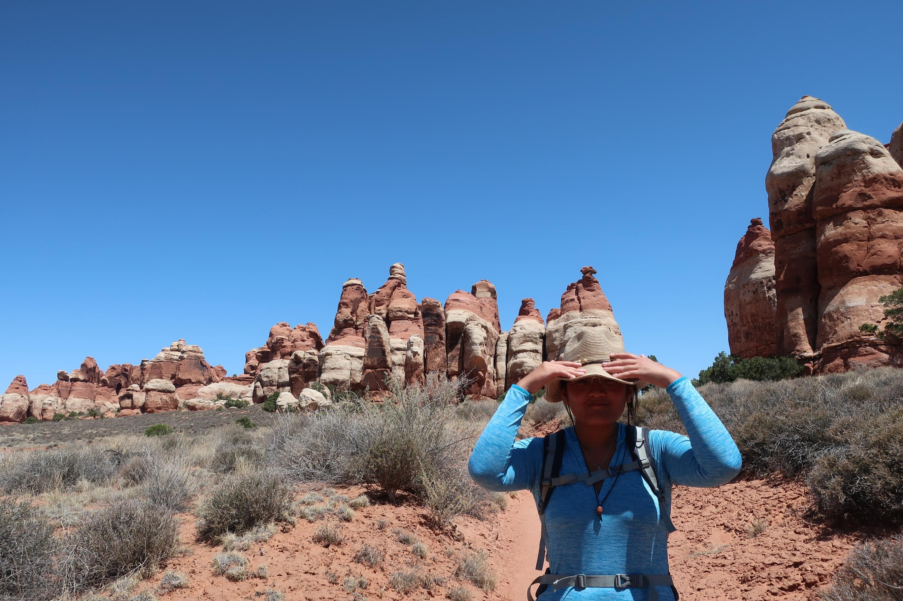

CCS-7 Applied Computer Science.  

Karen is a computational scientist who is interested in understanding, designing and developing application code with the scientists. She is also a computer scientist who is interested in learning and utilizing modern computing tools to optimize algorithms or visualize complex datasets. She got her M.S. in Computational Science, Engineering and Mathematics and B.S in Computer Science at the University of Texas – Austin.
 

### Andrew Reisner

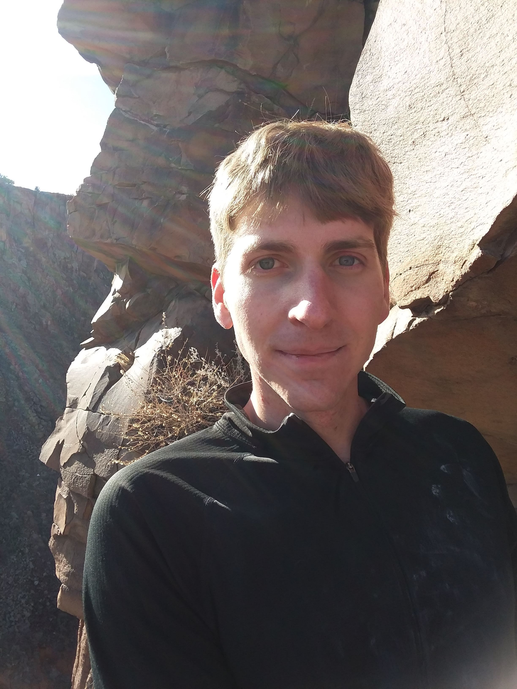

CCS-7 Applied Computer Science

Andrew is a computer scientist with a background in high performance
computing and numerical analysis.  He has experience in improving the
performance and scalability of structured multilevel solvers.  His
interests include parallel numerical algorithms on emerging
architectures and scalable linear solvers.

Andrew is an alumnus of the 2014 summer school class.

### Sumathi Lakshmiranganatha

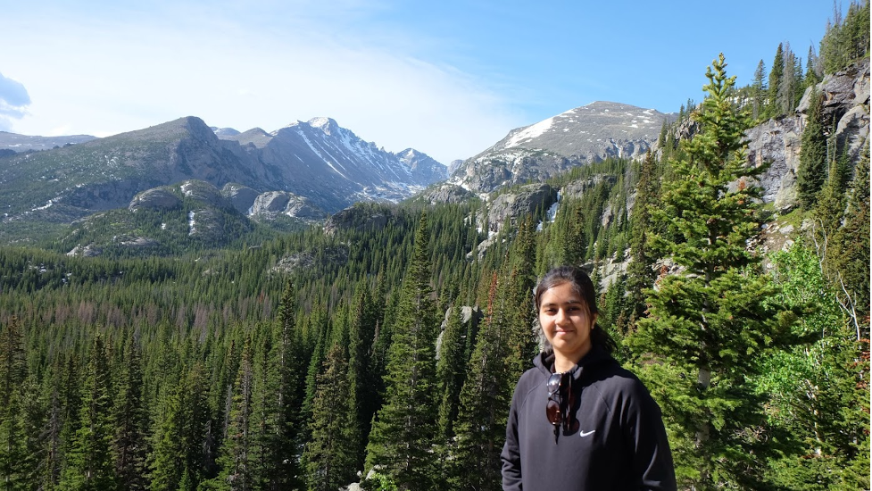

CCS-7 Applied Computer Science

Sumathi is a computational scientist with a background in Electrical and Computer Engineering. She has experience in porting and optimization of scientific applications like weather and power grid models on heterogeneous computing architectures. Her research interests include parallel-in-time algorithms on emerging hardware architectures and explainable machine learning models for scientific applications.

### Chris Mauney

<!-- 

 -->
HPC-ENV: HPC Environments
<!-- 
 -->

### Philipp Edelmann

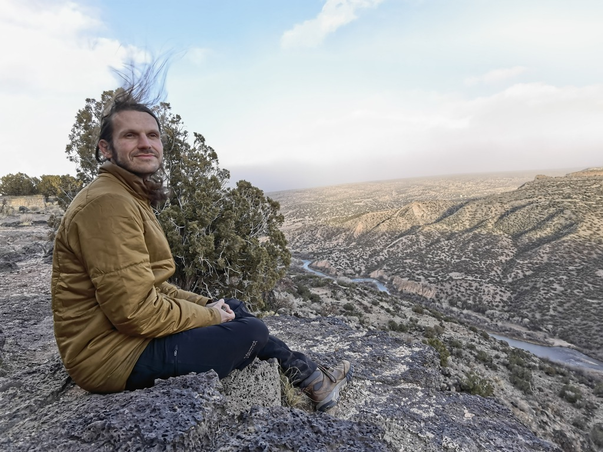

CCS-7 Applied Computer Science

Philipp is a staff scientist in CCS-7 with a background in stellar
astrophysics, numerical methods for hydrodynamics, and high-performance
computing. He has experience with implicit solvers for low Mach number
hydrodynamics, nuclear reaction networks, and spectral methods.
Currently he is working on developing portable and scalable multiphysics
applications as part of the Ristra project.

### Nirmal Prajapati

<!-- 

 -->
CCS-7 Applied Computer Science
<!-- 
 -->

### Jamal Mohd-Yusof

<!-- 

 -->
CCS-7 Applied Computer Science
<!-- 
 -->

<!-- 
### Reid Priedhorsky
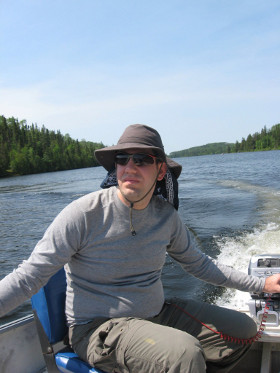

HPC-ENV HPC Environments

Reid is a staff scientist at Los Alamos National Laboratory. Prior to Los Alamos, he was a research staff member at IBM Research. He holds a Ph.D. in computer science from the University of Minnesota and a B.A., also in computer science, from Macalester College.

His work focuses on large-scale data analysis from both systems and applications perspectives. Recent lines of research include using social media and web traffic to monitor and forecast the spread of disease as well as developing technology to bring data-intensive computing and user-defined software stacks to existing high-performance computing systems.

In his spare time, he enjoys reading, bicycling, hiking (especially in the mountains and deserts of the American West), tinkering with things, photography, and hanging out with his wife and sons.

### Wesley Paul Even

CCS-2 Computational Physics and Methods

### Tim Randles

HPC-DES HPC Design

### Joshua C Dolence

CCS-2 Computational Physics and Methods

### Li-Ta (Ollie) Lo

CCS-7 Applied Computer Science

Li-Ta Lo a.k.a Ollie received a B.S. in Physics from National Chung-Hsing University in 1995 and a M.S. in Applied Mechanics from National Taiwan University in 1997. He joined Los Alamos National Laboratory in 2003, after working in the semiconductor industry for 4 years. As a multi-disciplined, multi-cultured person, he has enjoyed working with several teams and a diverse set of projects during his career at LANL. His current research interest includes data science, large-scale visualization and analysis, data-parallel programming and software engineering for scientific computing.

### Allen McPherson
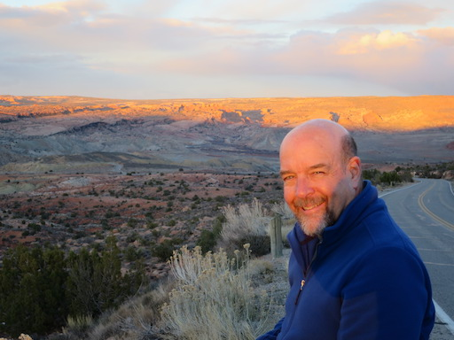

CCS-7 Applied Computer Science

Al is a semi-retired computer scientist working part-time as an Associate Staff Member on the BEE
project. Prior to retiring in 2015 Al was the CoDesign Team Lead and founder
of the Los Alamos CoDesign Summer School. Al's current
technical interest is the potential application of elastic, industrial-scale,
cloud technologies to HPC. In his (copious) spare time Al enjoys cooking,
hiking, and traveling with his lovely wife.

### Irina Sagert

CCS-2 Computational Physics and Methods

### Andrew Gaspar
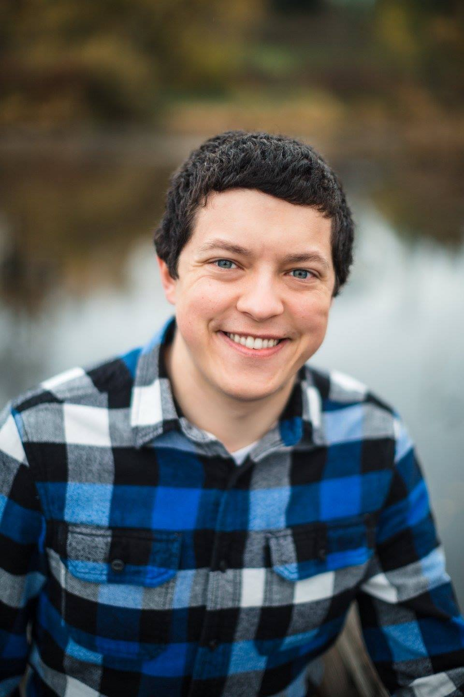

CCS-7 Applied Computer Science

Andrew Gaspar is a Computer Scientist in CCS-7 with a focus on Software Engineering. He has a Computer Engineering B.Sc. from the University of Nebraska – Lincoln. After graduating in 2014, he worked at Microsoft on the Network Driver stack in Windows 10, collaborating on a next generation network device driver API geared towards high-throughput network cards. In 2017, he joined Los Alamos. He now works on code modernization efforts in Los Alamos’ established, high-value Eulerian codes, primarily on adoption of C++14 and Kokkos. He also has an interest in the Rust programming language, and researching applications of it to High Performance Computing.

### Sam Jones

CCS-2 Computational Physics and Methods

### Irina Demeshko

CCS-7 Applied Computer Science

Irina is a computational scientist the Co-Design Team. Her current research work is currently focused on integrating task-based run-time systems into several software projects at LANL, but, in general, her research interests lay around new HPC technologies in application to large-scale scientific simulation codes.

### Patricia (Pat) Grubel

CCS-7 Applied Computer Science

Pat is a postdoctoral research associate in the Co-design Team. She has a background in electrical and computer engineering, future architectures, and performance analysis of task basked runtime systems.  Her current interests lie in modeling and performance optimization of applications using task based systems, cloud computing technologies, and benchmarking new architectures.

### Jonah Miller
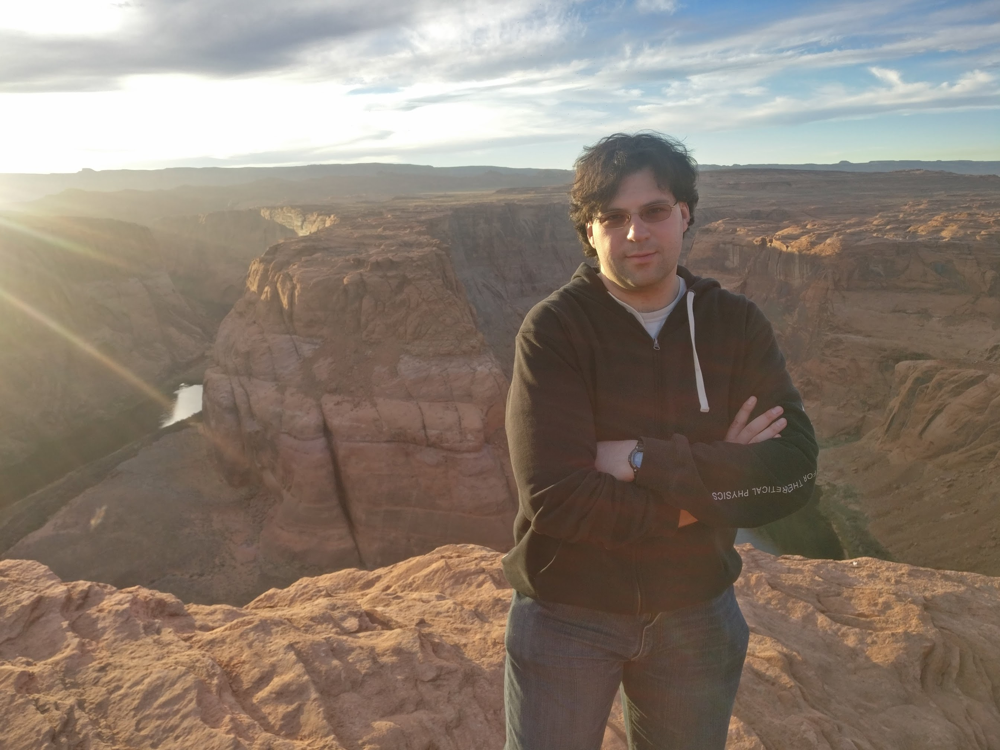

LANL CNLS Fellow, CCS-2 Computational Physics and Methods
 
Jonah is a computational physicist focusing on relativistic astrophysics. He has experience in scaleable algorithms and methods for astrophysics as well as on integrating complicated microphysics with large fluid codes. His PhD work focused on developing new methods for general relativity simulations. And his postdoctorate work focuses on combining general relativity, highly magnetized plasmas, and neutrino radiation physics to model what happens when two neutron stars merge.
 
Jonah is an alumnus of the 2016 summer school class
 
 

### David Gunter
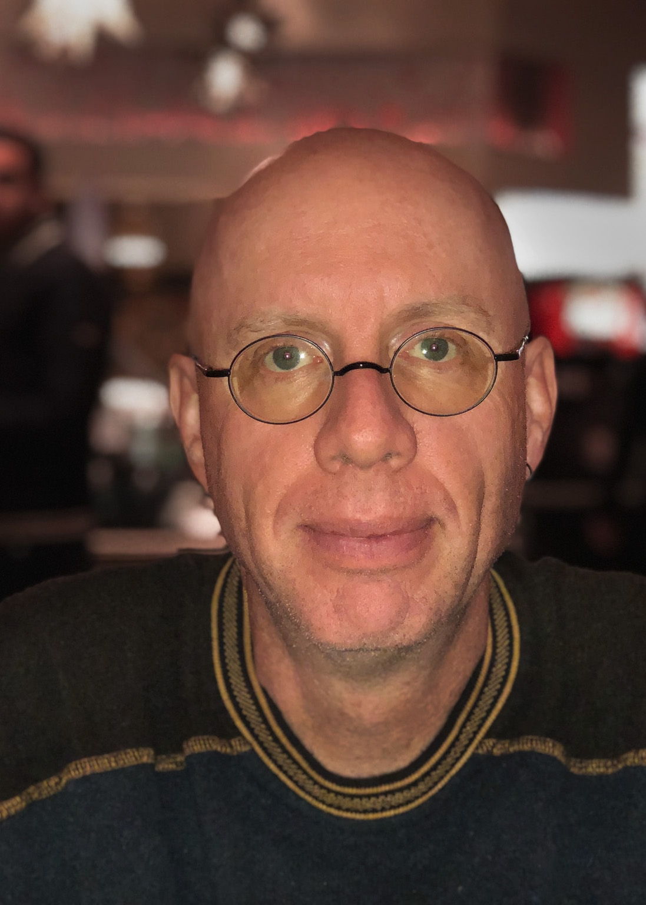

CCS-7 Applied Computer Science

David is former computational physicist working in the fields of condensed matter and electromagnetic computations. He now devotes his time to exploring novel algorithms, architectures, and programming models to help solve some of LANL's most pressing computational needs. He is a member of the IC Application Performance Team as well as the Future Architectures Team within CCS-7.

### Chris Malone
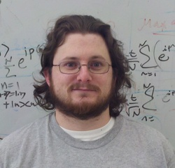

XCP-1 Lagrangian Applications

Chris is a computational scientist with a background in astrophysics. In particular, his interests lie in numerical modelling of astrophysical explosions driven by turbulent flow coupled to thermonuclear reactions, such as Type Ia supernovae and Type I X-ray bursts.  In recent years, his focus has been on high-energy physics in general, with applications and development on modern computing architectures.

### Marc Charest
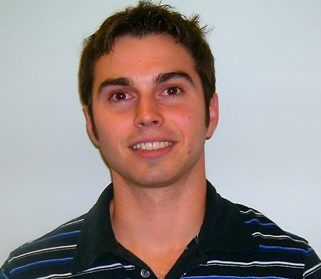

XCP-1 Lagrangian Applications

Marc's current research focuses on developing highly-scalable algorithms for multi-material and multi-physics problems that are specifically designed for next-generation computer architectures.  More specifically, he is developing/implementing advanced remapping strategies for arbitrary polygonal meshes.  Prior research at LANL focused on developing high-order methods for Eulerian and ALE hydrodynamics that can be used in conjunction with adaptive mesh refinement and unstructured grids.
-->

<h1> Founder </h1>

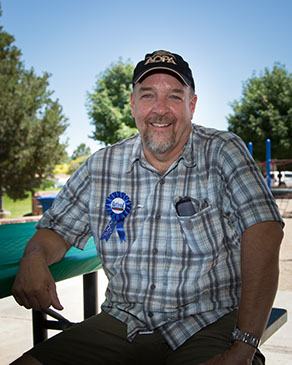

Allen McPherson  

R.I.P. (Retired in Paradise)  

Al McPherson is a computer scientist and the former lead of the CCS-7 Co-Design team.

<h1> Previous Leads </h1>

### Christoph Junghans

Moved on to Management.  

Christoph is a computational physicist and the current group leader of CCS-7.

### Robert Pavel

CCS-7 Applied Computer Science.  

Robert is a computational scientist with a background in electrical and computer engineering. He has experience in improving the performance of multi-scale physics applications through the use of task based models and NoSQL databases. His interests include evaluating the suitability of modern task based programming models with respect to scientific applications.  

Robert is an alumnus of the 2013 and 2014 summer school classes.

### Vinay Ramakrishnaiah

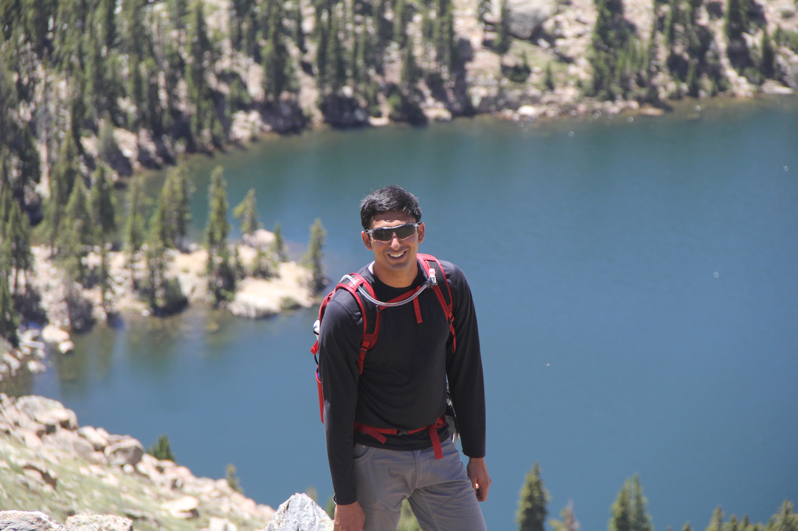

CCS-7 Applied Computer Science.  

Vinay was a staff scientist with a background in Electrical and Computer Engineering. He has experience in programming heterogeneous computer systems and is also skilled in antenna theory, signal processing, and optimizations. His research interests include revamping the coherent collection process in time-evolving satellite collector geometries, and also developing and evaluating applications for emerging hardware architectures.  

Vinay is an alumnus of the 2017 summer school class.

<h1> Previous mentors </h1>

<!-- ## 2022 -->
- Patrick McCormick

