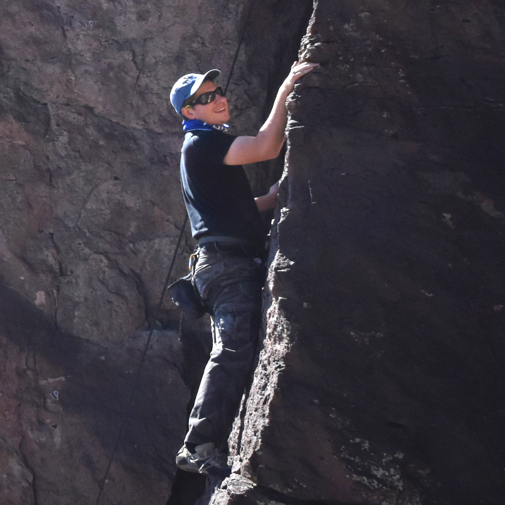
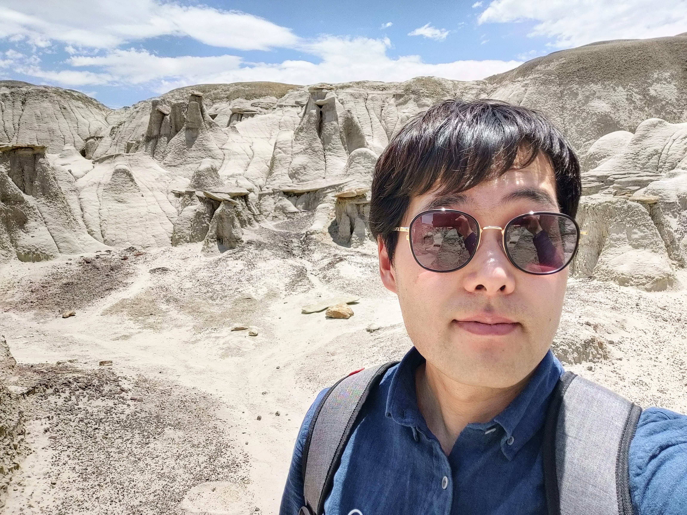
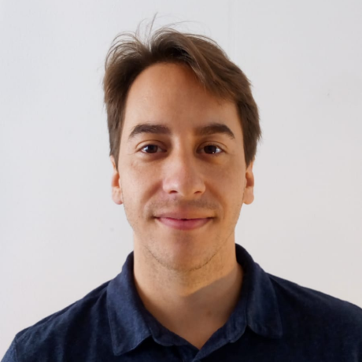
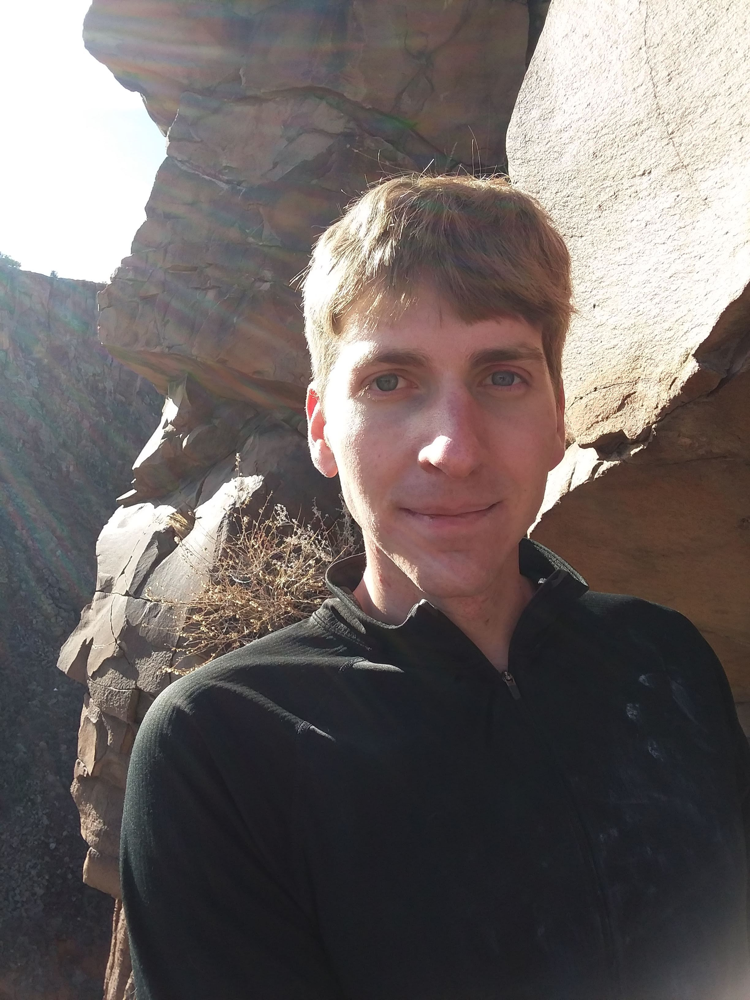
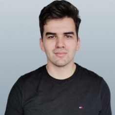
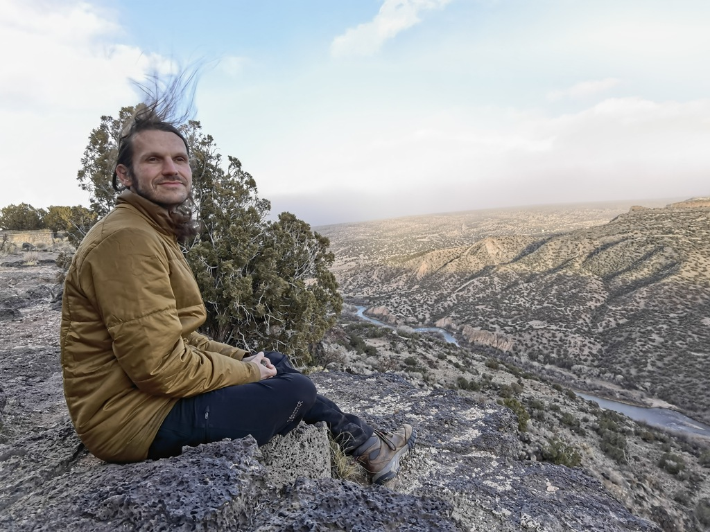
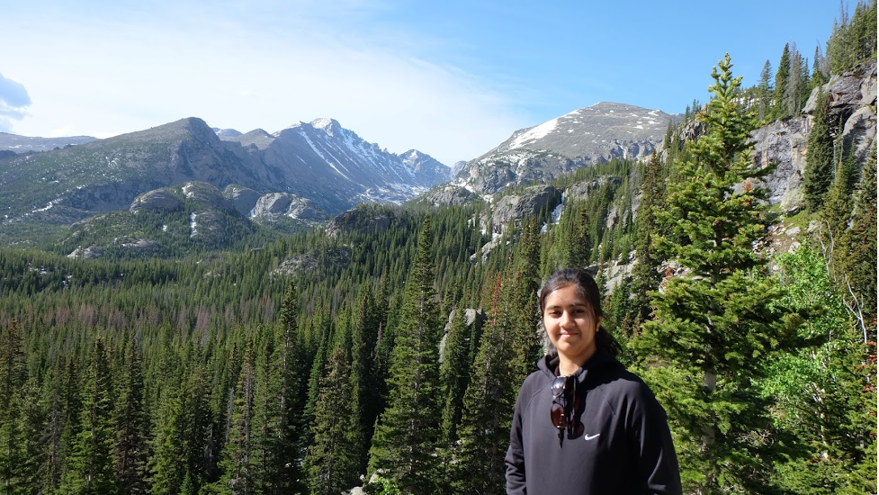
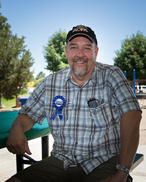

# Summer School Leads

#### Julien Loiseau

CCS-7 Applied Computer Science. 

Julien is a Computer Scientist with a background in High Performance Computing and simulation. He has experience in hybrid architectures and accelerated systems.  His postdoctorate work focuses on FleCSPH, a tool for Smoothed Particles Hydrodynamics simulations based on the FleCSI framework from LANL.  The intent is to provide an efficient and distributed tree data structure to FleCSI that allows the work to be offloaded to accelerators. The final goal of FleCSPH is to simulate large Astrophysics events.  

Julien is an alumnus of the 2016 summer school class.

#### Hyun Lim

CCS-2 Computational Physics and Methods.  

Hyun Lim is a staff scientist in CCS-2 with a background gravitational physics, astrophysics, and applied mathematics. He has experiences developing various multi-physics codes both Eulerian and Lagrangian frames to solve problems in astrophysics and magnetohydrodynamics. He also works on scalable numerical methods including adaptive mesh refinement and linear solvers.  

Hyun Lim is an alumnus of the 2016 summer school class.

# 2025 Summer School Mentors

#### Andrés Yagüe López 

CCS-7 Applied Computer Science

Andrés is a staff scientist in CCS-7 with a background in numerical methods, solar physics and nuclear astrophysics. He has worked in magnetohydrodinamics, nucleosynthesis and galactic chemical evolution simulations, including stiff nuclear networks, developing novel numerical methods for the latter. He is interested in developing simulations that can take full advantage of HPC systems capabilities.

#### Andrew Reisner

CCS-7 Applied Computer Science

Andrew is a computer scientist with a background in high performance
computing and numerical analysis.  He has experience in improving the
performance and scalability of structured multilevel solvers.  His
interests include parallel numerical algorithms on emerging
architectures and scalable linear solvers.
 

Andrew is an alumnus of the 2014 summer school class.

#### Brendan Krueger

<!---->

CCS-7 Applied Computer Science

Brendan is a computational scientist with experience in high performance computing and physical simulations.  He has worked on many projects at LANL, including the Eulerian Applications Project, the Singe thermonuclear reactions library, the Portage remapping library, and the FleCSI framework.  His experience includes implementing physics models, porting code to run on GPUs, and developing software infrastructure to support subject-matter experts in writing their own simulation tools.

#### Maxim Moraru

CCS-7 Applied Computer Science

Maxim is a computational scientist in CCS-7 with a background in High-Performance Computing. He has experience in hybrid architectures and HPC runtime systems. His research interests include high-speed communication, dynamic task mapping, and machine learning models. 
 

Maxim is an alumnus of the 2021 and 2022 summer school classes.

#### Nirmal Prajapati

<!-- 

 -->
CCS-7 Applied Computer Science
<!-- 
 -->

#### Philipp Edelmann

CCS-7 Applied Computer Science

Philipp is a staff scientist in CCS-7 with a background in stellar
astrophysics, numerical methods for hydrodynamics, and high-performance
computing. He has experience with implicit solvers for low Mach number
hydrodynamics, nuclear reaction networks, and spectral methods.
Currently he is working on developing portable and scalable multiphysics
applications as part of the Ristra project.

#### Sumathi Lakshmiranganatha

CCS-7 Applied Computer Science

Sumathi is a computational scientist with a background in Electrical and Computer Engineering. She has experience in porting and optimization of scientific applications like weather and power grid models on heterogeneous computing architectures. Her research interests include parallel-in-time algorithms on emerging hardware architectures and explainable machine learning models for scientific applications.

<h1> Founder </h1>

Allen McPherson  
R.I.P. (Retired in Paradise)  
Al McPherson is a computer scientist and the former lead of the CCS-7 Co-Design team.

<h1> Previous Leads </h1> 
- Christoph Junghans
- Robert Pavel
- Vinay Ramakrishnaiah

<h1> Previous mentors </h1>
- Andrew Gaspar
- Ben Bergen
- Chris Malone
- Chris Mauney
- David Gunter
- Irina Demeshko
- Irina Sagert
- Jamal Mohd-Yusof
- Jonah Miller
- Joshua C Dolence
- Karen Tsai 
- Li-Ta (Ollie) Lo
- Marc Charest
- Patricia (Pat) Grubel
- Patrick McCormick
- Reid Priedhorsky
- Sam Jones
- Wesley Paul Even
