<h1> Past CDSS classes </h1>

### Class of 2022: Hardware/Software co-design for automated hardware pipelining.

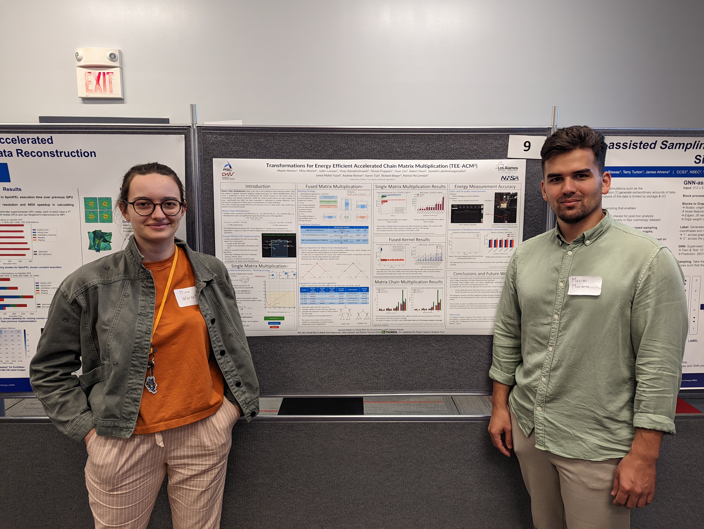 

 <a href="posters/poster-2022.pdf" target="_blank" >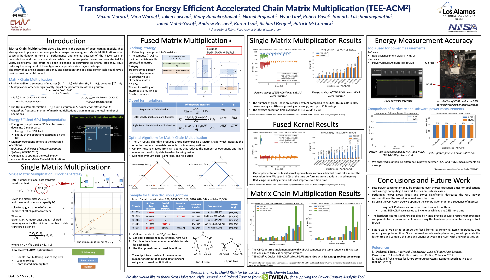</a>

Maxim Moraru (University of Reims Champagne Ardenne), Mina Warnet (University of Reims Champagne Ardenne)

 

### Class of 2021: Optimizing and Extending the Functionality of EXARL for Scalable Reinforcement Learning 

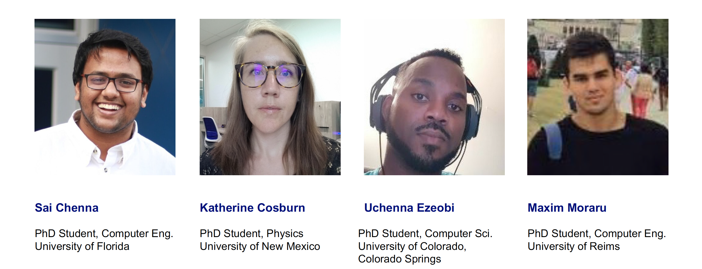 <!--

--> <a href="posters/poster-2021.pdf" target="_blank">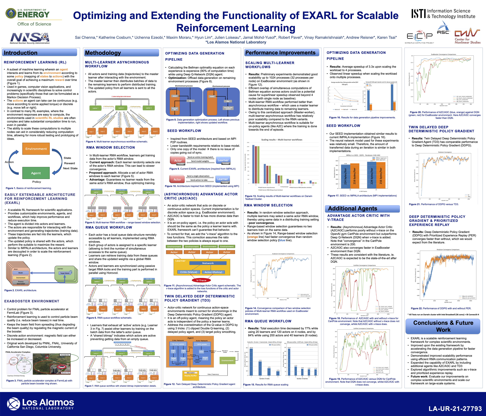</a>

 

### Class of 2019: Code Portability and Core Collapse Supernovae

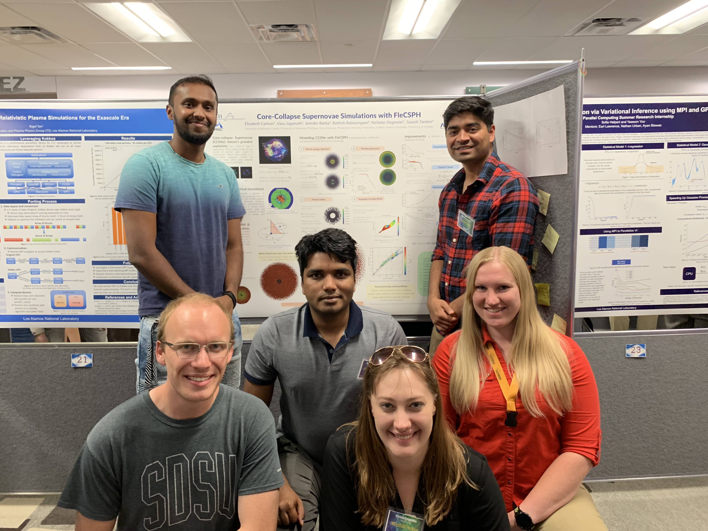 

 <a href="posters/poster-2019.pdf" target="_blank">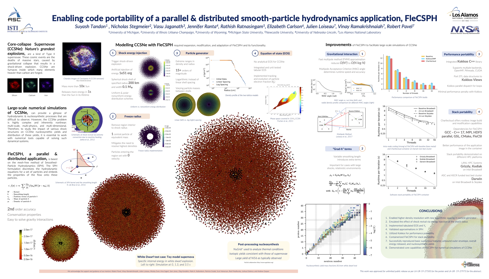</a>

Rathish Ratnasingam (Newcastle University), Suyash Tandon (University of Michigan), Nicholas Stegmeier (University of Illinois Urbana-Champaign), Vasu Jaganath (University of Wyoming), Elizabeth Carlson (University of Nebraska), Jennifer Ranta (Michigan State University)

 

### Class of 2018: Tabulated Equation of State

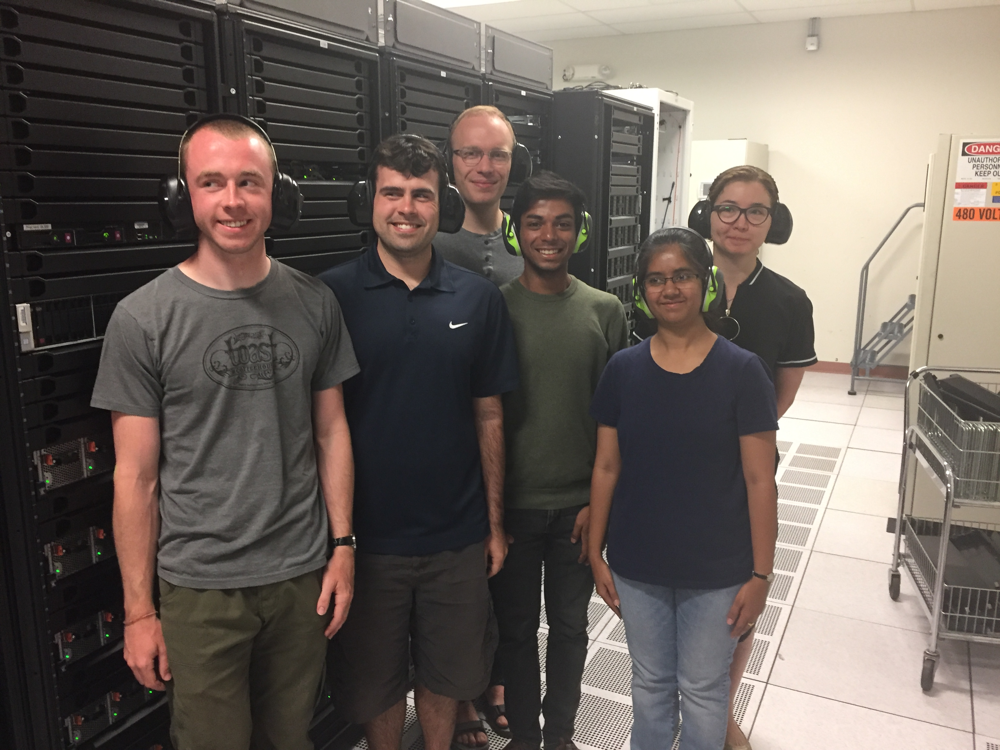 

 <a href="posters/poster-2018.pdf" target="_blank">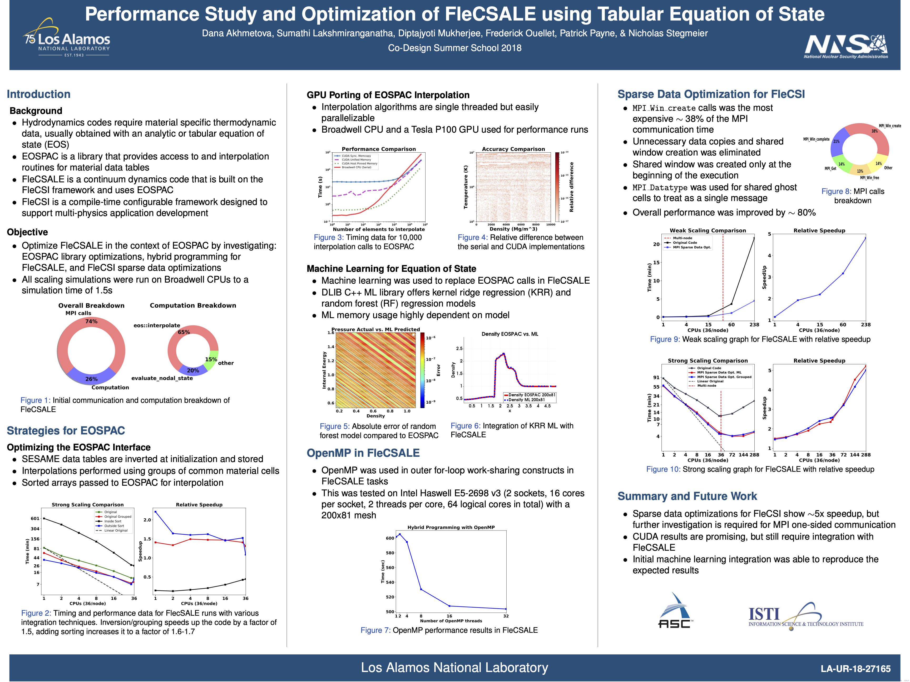</a>

Patrick Payne (Stony Brook University), Frederick Ouellet (University of Florida), Nicholas Stegmeier (South Dakota State University), Diptajyoti Mukherjee (Allegheny College), Sumathi Lakshmiranganatha (University of Wyoming), Dana Akhmetova (KTH Royal Institute of Technology)

 

### Class of 2017: Accelerated Molecular Dynamics

 

 <a href="posters/poster-2017.pdf" target="_blank">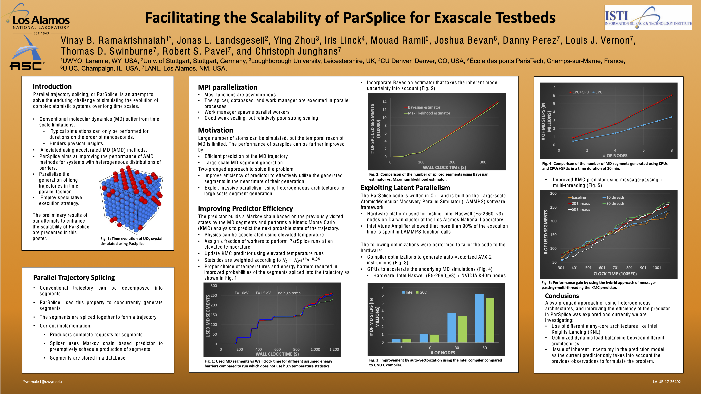</a>

Ying Zhou (University of Loughborough), Vinay Ramakrishnaiah (University of Wyoming), Jonas Landsgesell (Universitdt Stuttgart), Mouad Ramil (Ecole des Ponts), Josh Bevan (UIUC), Iris Linck (University of Colorado Denver)

 

### Class of 2016: Astrophysics - Neutron Star Mergers

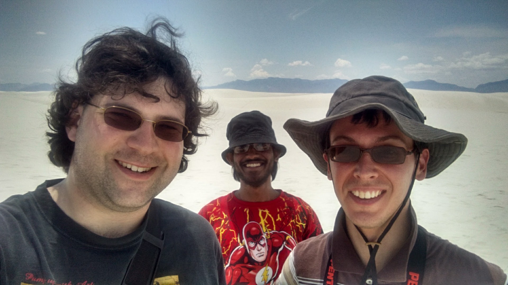
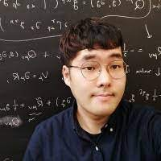
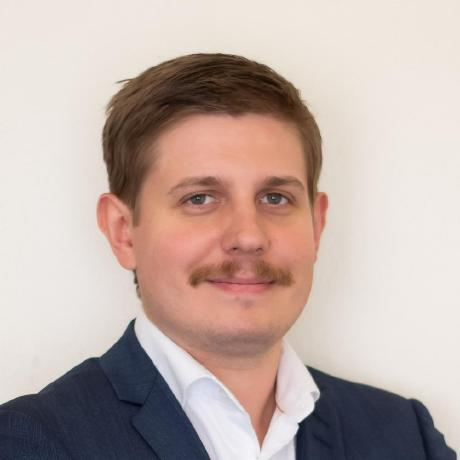

 <a href="posters/poster-2016.pdf" target="_blank">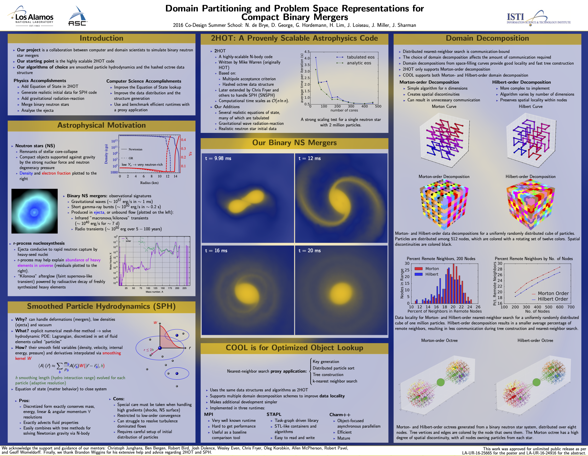</a>

Nicola de Brye (UV), Daniel George (UIUC), Glenn Hordemann (TAMU), Hyun Lim (BYU), Julien Loiseau (URCA), Jonah Miller (PI), Jonathan Sharman (Rice)

 

### Class of 2015: Quantum Molecular Dynamics

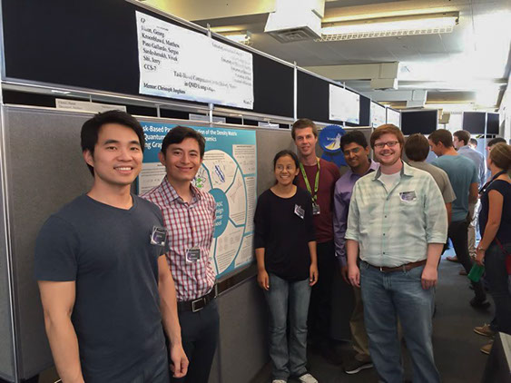

Guangjie “Jerry” Shi (UGA), Sergio Pino Gallardo (U. Delaware), Purnima Ghale (UIUC), Georg Hahn (Imperial College London), Vivek Sardeshmukh (U. IOWA), Matthew Kroonblawd (U. Missouri)

 

### Class of 2014: Adaptive Mesh Refinement (AMR) for hydrodynamics simulations

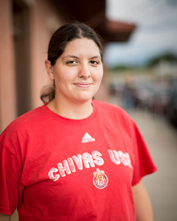
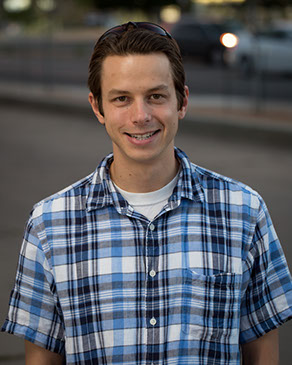
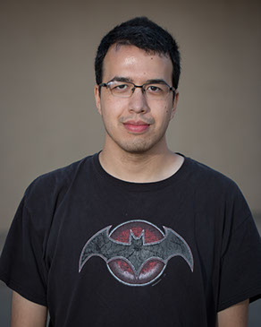
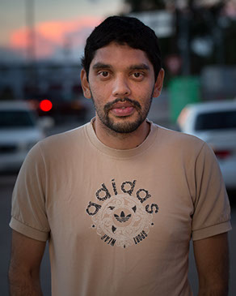
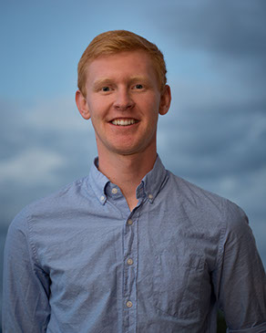
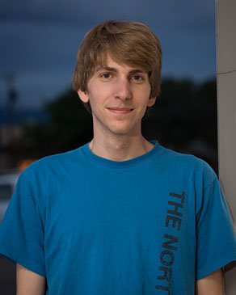

 <a href="posters/poster-2014.pdf" target="_blank">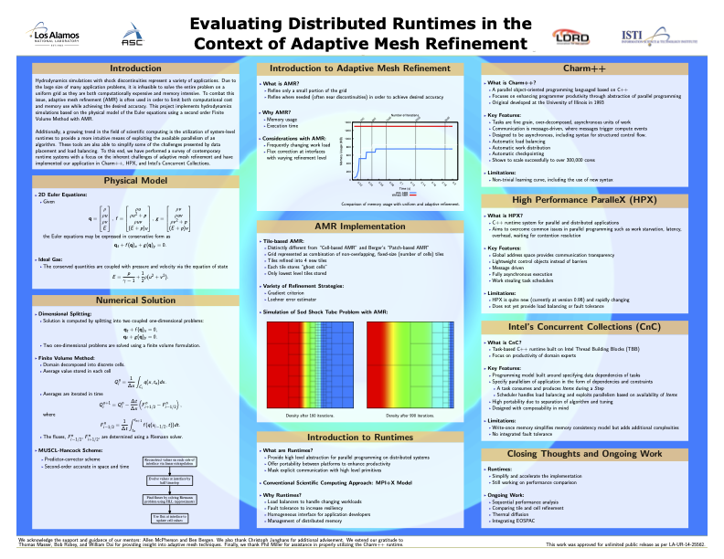</a>

Erin Carrier (UIUC), Ken Czuprynski (UI), Robert Pavel (UD), Pascal Grosset (UU), Robert Bird (Warwick University), Andrew Reisner (UIUC)

 

### Class of 2013: Materials in Extreme Environments

 

 <a href="posters/poster-2013.pdf" target="_blank">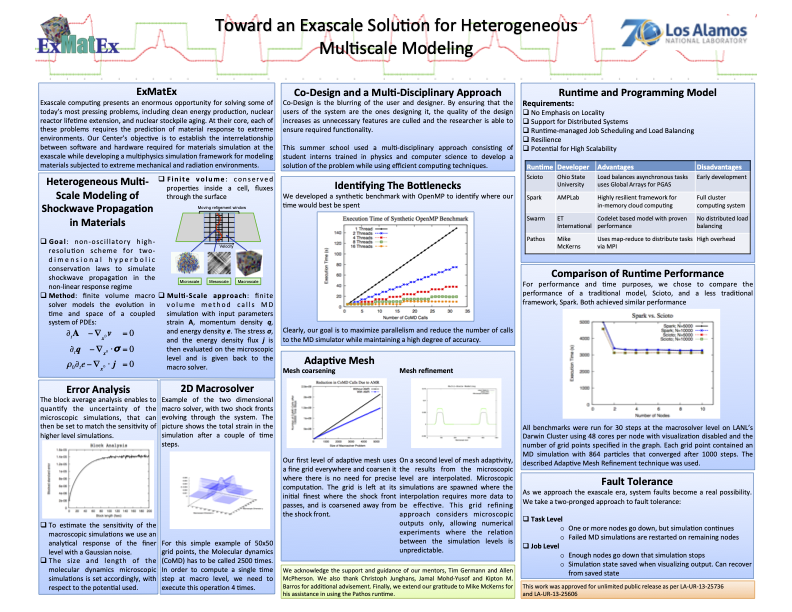</a>

Bertrand Rouet-Leduc (University of Cambridge),  Emmanuel Cieren (CEA), Venmugil Elango (The Ohio State University), Robert S. Pavel (University of Delaware), Axel Y. Rivera (University of Utah),  Dominic Roehm (Universität Stuttgart)

 

### Class of 2012: Scale Bridging Approach to a Steady-state Neutron Transport

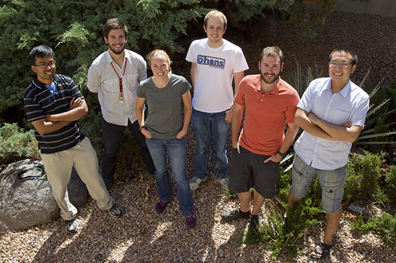

Karthik Murthy (Rice), Emmanuel Cieren (LaBRI, France), Colleen McCarthy (NC State), Nicolas Feltman (CMU), Chris Leibs (CU Boulder), Yijie Wang (University of South Florida)

 

### Class of 2011: Quasi Diffusion Accelerated Monte Carlo

Han Dong (SUNY Buffalo), Mahesh Ravishankar (Ohio State), Paul Sathre (Virginia
State),Michael Sullivan (U. Texas Austin), William Taitano (University of New
Mexico), Jeffery Willert (North Carolina State)

 

