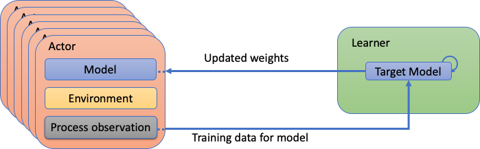

## What is the Co-Design Summer School?

The Los Alamos ASC/ExaLearn Co-Design Summer School was created to train future scientists to work on the kinds of interdisciplinary teams that are demanded by today’s scientific challenges. Launched in 2011, the summer school recruits top candidates in a range of fields spanning domain sciences, applied mathematics, computational and computer sciences, and computer architecture. Participants work together to solve a focused problem that is designed to build the skills needed to tackle the grand challenges of the future. Foremost among the skills on which we focus is the ability of students to work across disciplines with other team members, while employing their own unique expertise. This is the heart of Co-Design.

Past summer school challenges have included problems in kinetic theory (Boltzmann Transport Equation), molecular dynamics, hydrodynamics (Adaptive Mesh Refinement), quantum molecular dynamics, astrophysics (core-collapse supernovae and neutron star mergers), and tabulated equations of state. The summer school is hosted by the Applied Computer Science Group (CCS-7), led by Patrick Kelly.

## What is Co-Design?

Co-Design is the social and technical equivalent of a multiple-constraint optimization problem.  The rapid evolution of computing architectures and the expanding space between specializations in domain science and computer architecture means that it is virtually impossible for a single individual to cover all of the skills needed to solve current-day computational science challenges.  Co-Design bridges this space through interactions between members of an interdisciplinary team.  With the right amount of overlap, team members can communicate with each other effectively to solve a problem.

## 2021 Co-Design Summer School Focus:

## Optimization, Scalability, and Performance-Portability of Reinforcement Learning for High-Performance Computing Environments

*Fig. 1: Overview of Easily eXtendable Architecture for Reinforcement Learning (EXARL) (image credit: ExaLearn Control Team).*

In recent years, the ability to learn from large datasets has advanced significantly due to increases in hardware performance, advances in machine learning (ML) algorithms, and the availability of high quality open datasets. However, current ML systems are generally trained prior to deployment and are not capable of adapting to new datasets in the field, limiting real-time or online learning.

Reinforcement Learning (RL) is an elegant formalization of the problem of intelligence and deep RL has led to many groundbreaking discoveries. These advancements in RL come at a cost of added complexity and scale of the underlying algorithms and are hindering researchers to rapidly prototype ideas. The Easily eXtendable Architecture for Reinforcement Learning (EXARL) framework is an attempt to alleviate this hindrance and advance the use of RL for scientific applications. We want to explore online learning of RL systems using Exascale machines for generating data and train the neural network in real time.

This year’s Co-Design Summer School will investigate, assess, and improve upon the performance and scalability of the EXARL framework. EXARL is developed as part of the ExaLearn Control project and is a scalable reinforcement learning framework that extends the ubiquitously used OpenAI Gym’s capabilities. The framework has many moving parts including testing different RL environments, development of new RL agents and workflows. Students will explore algorithmic improvements such as vtrace and alternative communication patterns in the context of scientific environments meant to represent DOE use cases.

A quantitative and qualitative assessment of performance, scalability, and efficiency of reinforcement learning frameworks with a focus on high performance computing environments will increase the utility of the EXARL framework and our understanding of how to better integrate reinforcement learning techniques into traditional HPC applications. This school will serve to aid LANL’s mission and explore the use of reinforcement learning frameworks on exascale platforms in a manner that will take advantage of the hardware and infrastructure capabilities of supercomputing environments.
