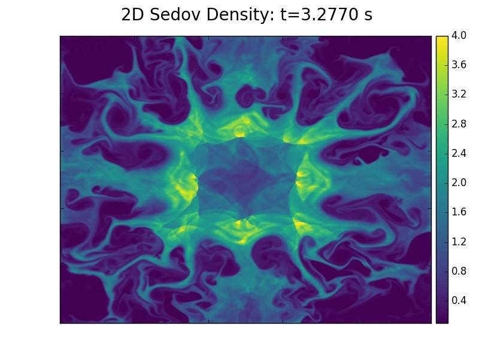

## What is the Co-Design Summer School?

The Los Alamos ISTI/ASC Co-Design Summer School was created to train future scientists to work on the kinds of interdisciplinary teams that are demanded by today’s scientific challenges. Launched in 2011, the summer school recruits top candidates in a range of fields spanning domain sciences, applied mathematics, computational and computer sciences, and computer architecture. Participants work together to solve a focused problem that is designed to build the skills needed to tackle the grand challenges of the future. Foremost among the skills on which we focus is the ability of students to work across disciplines with other team members, while employing their own unique expertise. This is the heart of Co-Design.
 
 Past summer school challenges have included problems in kinetic theory (Boltzmann Transport Equation), molecular dynamics, hydrodynamics (Adaptive Mesh Refinement), quantum molecular dynamics, and astrophysics (neutron star mergers).  The summer school is hosted by the Applied Computer Science Group (CCS-7), lead by Linn Collins.

## What is Co-Design?
Co-Design is the social and technical equivalent of a multiple-constraint optimization problem.  The rapid evolution of computing architectures and the expanding space between specializations in domain science and computer architecture means that it is virtually impossible for a single individual to cover all of the skills needed to solve current-day computational science challenges.  Co-Design bridges this space through interactions between members of an interdisciplinary team.  With the right amount of overlap, team members can communicate with each other effectively to solve a problem.

> ## 2018 Co-Design Summer School Focus:
> ## Equation of State

>  LANL is currently investigating ways to improve the stability and performance of hydrodynamic multi-physics simulations of multi-material flows with dynamic material behavior.  Examples of such types of problems, among many others, include inertial confinement fusion and flyer plate experiments. Modeling these types of problems are key to improving our overall understanding of physics and executing LANL’s mission.  However, accurate mathematical models of these problems are currently computationally intractable on current architectures due to their complex nature. Advances in the algorithms used to solve these problems, and the programming techniques used to maximize their performance on current and emerging architectures, are necessary to meet the laboratory’s goals.

> 

> One area where potential improvements are sought involves the interactions between multi-physics algorithms and the tabular equation of state (EOS) data.  Physics codes must constantly query a material's EOS to obtain information such as pressure and temperature from other known quantities.  This query can occur several times per time-step at each computational cell or mesh point for each material that may exist at a particular query location.  Such queries may involve simple analytic expressions, or expensive interpolations using tabular data.

> This year's Co-Design Summer School will investigate ways to reduce the cost of expensive tabular EOS queries with the goal of improving the overall solution time for complex multi-material problems.  This investigation will make use of FleCSALE as a testbed, which is a compile-time configurable Arbitrary Lagrangian-Eulerian framework designed to support multi-physics application development. FleCSALE builds upon FleCSI, a mesh/compute abstraction layer that aims to insulate developers from the underlying runtime -- MPI, Legion, and Charm++ are some examples of runtimes used in HPC.  To obtain the necessary information about different materials' equations of state, FleCSALE makes use of EOSPAC. EOSPAC is a locally developed API library that handles both manipulation (e.g., dependent and independent variable inversion) and interpolation of tabular EOS data.  All three codes are open-source.

> This school will serve to aid LANL's mission and explore the development of new numerical and computer science approaches to efficiently use EOSPAC within the context of FleCSALE. Possible improvements include distributed, in-memory caching databases and machine-learning predictive capabilities. Machine-learning techniques will also be used to explore the direct conversion of tabular EOS data to analytical functions for direct use in FleCSALE. This code is part of a wider Department of Energy program aimed at carrying out materials simulations at the exascale.
