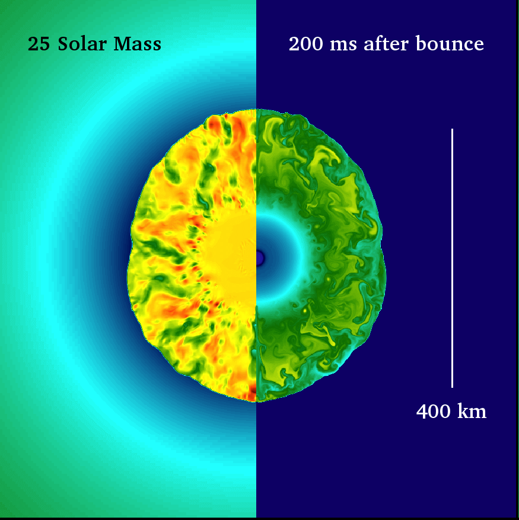

## What is the Co-Design Summer School?

The Los Alamos ISTI/ASC Co-Design Summer School was created to train future scientists to work on the kinds of interdisciplinary teams that are demanded by today’s scientific challenges. Launched in 2011, the summer school recruits top candidates in a range of fields spanning domain sciences, applied mathematics, computational and computer sciences, and computer architecture. Participants work together to solve a focused problem that is designed to build the skills needed to tackle the grand challenges of the future. Foremost among the skills on which we focus is the ability of students to work across disciplines with other team members, while employing their own unique expertise. This is the heart of Co-Design.

 Past summer school challenges have included problems in kinetic theory (Boltzmann Transport Equation), molecular dynamics, hydrodynamics (Adaptive Mesh Refinement), quantum molecular dynamics, astrophysics (neutron star mergers), and tabulated equations of state..  The summer school is hosted by the Applied Computer Science Group (CCS-7), lead by Linn Collins.

## What is Co-Design?

Co-Design is the social and technical equivalent of a multiple-constraint optimization problem.  The rapid evolution of computing architectures and the expanding space between specializations in domain science and computer architecture means that it is virtually impossible for a single individual to cover all of the skills needed to solve current-day computational science challenges.  Co-Design bridges this space through interactions between members of an interdisciplinary team.  With the right amount of overlap, team members can communicate with each other effectively to solve a problem.

## 2019 Co-Design Summer School Focus:

## Containerization of HPC Applications: Core-Collapse Supernovae

High Performance Computing applications are increasingly being built on user-defined software stacks (UDSS) instead of, or in addition to, the stacks provided by supercomputing centers. These support user needs for complex dependencies or build requirements, portability, and consistency. To bring these workflows to existing, minimally altered, HPC resources, LANL has developed Charliecloud. Charliecloud uses the Linux user and mount namespaces to run industry-standard Docker containers with no privileged operations or daemons on center resources. This avoids most security risks without compromising the performance and functionality provided by the underlying hardware.

As a case study for utilizing Charliecloud to deploy a high performance multi-physics code, we will study the effects of asymmetries and mixing on the distribution of isotopic yields in core-collapse supernovae.  These types of models are used by the astrophysics community to determine where and how the elements that we observe on earth and across the universe were formed.

The proposed simulations will be completed using FleCSPH,  an open-sourced smoothed particle hydrodynamics code developed on top of the FleCSI framework.  FleCSI is a mesh/compute abstraction layer that aims to insulate developers from the underlying runtime.  This code uses a task-based approach to provide scalable and asynchronous execution on modern HPC systems. Potential improvements to the physics capabilities of FleCSPH include implementing advanced equations of state, nuclear reaction networks, and new set-up utilities.   In addition to conducting the FleCSPH simulations post-processing will  be completed using a detailed nucleosynthesis network code to obtain the final detailed yields. 

 

This year's Co-Design Summer School will investigate Asymmetries And Mixing in Core-Collapse Supernovae in the context of containerization. An interdisciplinary team will use Charliecloud to improve the portability of FleCSPH to take advantage of a wider range of platforms and hardware. Another focus will be how FleCSPH needs to be modified to increase latency insensitivity through asynchrony and algorithmic improvements. FleCSPH builds upon FleCSI, a mesh/compute abstraction layer that aims to insulate developers from the underlying software runtimes while allowing for a range of computer architectures to be utilized.

This school will serve to aid LANL's mission and explore the development of new numerical and computer science approaches to efficiently study core-collapse supernovae within the context of FleCSPH while simultaneously improving its portability. Possible improvements include rapid deployment to a range of platforms as well as better coupling of support and post-processing utilities. This code is part of a wider Department of Energy program aimed at carrying out materials simulations at the exascale.
