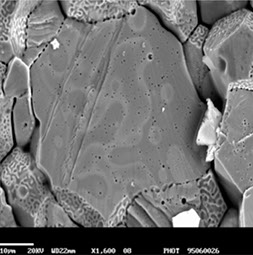

## What is the Co-Design Summer School?

The Los Alamos ISTI/ASC Co-Design Summer School was created to train future scientists to work on the kinds of interdisciplinary teams that are demanded by today’s scientific challenges. Launched in 2011, the summer school recruits top candidates in a range of fields spanning domain sciences, applied mathematics, computational and computer sciences, and computer architecture. Participants work together to solve a focused problem that is designed to build the skills needed to tackle the grand challenges of the future. Foremost among the skills on which we focus is the ability of students to work across disciplines with other team members, while employing their own unique expertise. This is the heart of Co-Design.
 
 Past summer school challenges have included problems in kinetic theory (Boltzmann Transport Equation), molecular dynamics, hydrodynamics (Adaptive Mesh Refinement), quantum molecular dynamics, and astrophysics (neutron star mergers).  The summer school is hosted by the Applied Computer Science Group (CCS-7), lead by Linn Collins.

## What is Co-Design?
Co-Design is the social and technical equivalent of a multiple-constraint optimization problem.  The rapid evolution of computing architectures and the expanding space between specializations in domain science and computer architecture means that it is virtually impossible for a single individual to cover all of the skills needed to solve current-day computational science challenges.  Co-Design bridges this space through interactions between members of an interdisciplinary team.  With the right amount of overlap, team members can communicate with each other effectively to solve a problem.

> ## 2017 Co-Design Summer School Focus:
> ## Materials Science- Fission gas mobility in nuclear fuels

> Nuclear fuels are very complex systems that operate in extremely harsh environments. Contributing to the difficulty in accurately predicting the performance of these materials is the fact that nuclear reactions constantly change their chemical makeup. For example, fission gases (such as Xenon and Krypton) are constantly produced. These gases diffuse through the fuel and condense in bubbles that can severely affect in-reactor performance because they reduce thermal conductivity, cause fuel swelling that leads to mechanical interaction with the cladding, increase the pressure inside the cladding, etc. Understanding how these gasses diffuse and migrate through the fuel is therefore of the outmost importance to design accurate fuel evolution models that enable the safe and efficient operation of nuclear reactors.

> 
> *Scanning electron microscopy (SEM) images of fission gas bubbles in UO2 showing large, inter-granular bubbles on grain boundaries. [R.J. White, R.C. Corcoran, and J.P. Barnes, “A Summary of Swelling Data Obtained from the AGR/Halden Ramp Test Programme”, Report R&T/NG/EXT/REP/0206/02 (2006).]*

> The 2017 summer school will develop new state-of-the-art atomistic simulations tools simulate the motion of fission-gas-containing defects over long timescales. The primary objective of these simulations is to identify the optimal diffusion pathways for a range of defects, as well as characterize their mobility. This information is essential to properly parameterize higher-scale fuels performance codes.

> This investigation will require the development of new numerical methods and computational science strategies to enable large-scale simulation runs on advanced computing architectures. In particular, we will focus on the recently developed ParSplice code – developed by Danny Perez, of the Physics and Chemistry of Materials group (T-1) – to use modern task-based and functional programming model implementations for scalable execution on the most recent HPC systems available. This code is part of a wider Department of Energy program aimed at carrying out atomistic materials simulations at the exascale.

