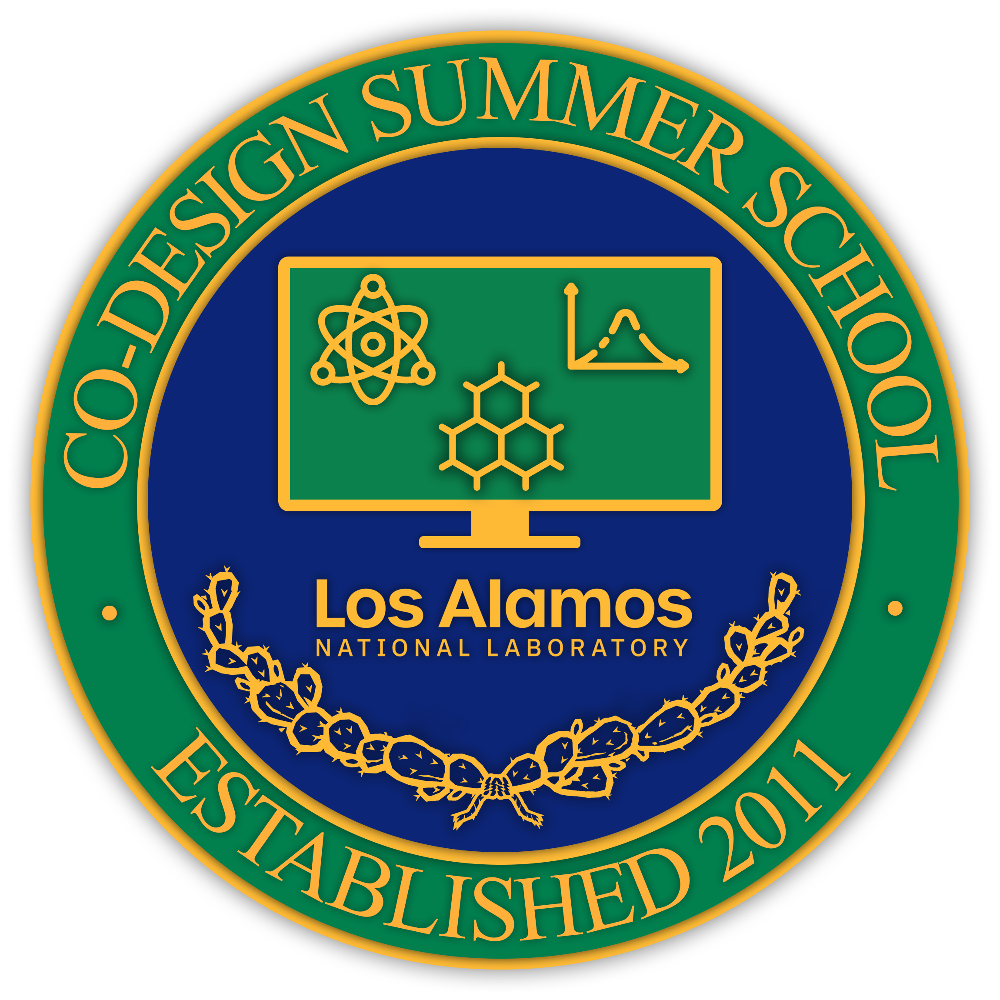
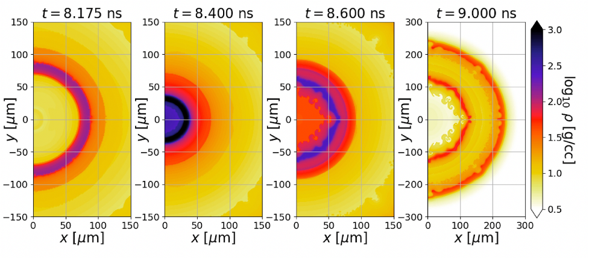

## What is the Co-Design Summer School?

The Los Alamos National Laboratory Co-Design Summer School was created to train future scientists to work on the kinds of interdisciplinary teams that are demanded by today’s scientific challenges. Launched in 2011, the summer school recruits top candidates in a range of fields spanning domain sciences, applied mathematics, computational and computer sciences, and computer architecture. Participants work together to solve a focused problem that is designed to build the skills needed to tackle the grand challenges of the future. Foremost among the skills on which we focus is the ability of students to work across disciplines with other team members, while employing their own unique expertise. This is the heart of Co-Design.

Past summer school challenges have included problems in kinetic theory (Boltzmann Transport Equation), molecular dynamics, hydrodynamics (Adaptive Mesh Refinement), quantum molecular dynamics, astrophysics (core-collapse supernovae and neutron star mergers), and tabulated equations of state. The summer school is hosted by the Applied Computer Science Group (CCS-7), led by Christoph Junghans.

## What is Co-Design?

Co-Design is the social and technical equivalent of a multiple-constraint optimization problem. The rapid evolution of computing architectures and the expanding space between specializations in domain science and computer architecture means that it is virtually impossible for a single individual to cover all of the skills needed to solve current-day computational science challenges. Co-Design bridges this space through interactions between members of an interdisciplinary team. With the right amount of overlap, team members can communicate with each other effectively to solve a problem.

## 2024 Co-Design Summer School Focus:

## Radiation Hydrodynamics at Scale using FleCSI. 

Radiation hydrodynamics plays a crucial role in the study of a wide variety of problems, such as high energy density physics with inertial confinement fusion but also in astrophysics with everything from neutrino transport in the engines of astrophysical transients to photon transport in their observed emission.
The 2024 Summer School subject will focus on modeling radiation hydrodynamics using the FleCSI framework. This work can be decomposed in two steps: the radiative transfer library and the hydrodynamics code based on the Burton mesh, a specialization of FleCSI. The hydrodynamics part will feature a mesh based implementation for our test, either Lagrangian or Eulerian. 
In the radiation library implementation, we will use flux limited diffusion as a starting point. Multiple different approaches can then be explored for better treatment of the radiation energy, such as the multigroup method.
This base code will enable us to run interesting simulations including Lowrie radiating shock, Su-Olson Marshak wave, and ablation problems. These simulations are important to understand various physical phenomena such as inertial confinement fusion and spectra computation from supernovae.

The complexification of supercomputers, in both number of nodes and on-node hybridization, forces us to rethink our approach to high performance computing.  In this context, task-based parallelism provides a promising path forward. The summer school proposes to use the FleCSI framework as a base for the simulations. 
[FleCSI](https://github.com/flecsi/flecsi) is a compile time configurable framework from LANL. It supports the development of multiphysics applications and introduces a functional programming model which can use multiple backends such as Legion, MPI or HPX. FleCSI proposes different topologies that are then extended via a specialization, allowing to target a specific problem. 
LANL is funding a next generation exascale supercomputer called [Venado](https://discover.lanl.gov/news/0530-venado/). This machine will combine the new NVIDIA architectures: Grace and Hopper. The aim for the summer school is to run the simulations at scale on Venado, taking advantage of the NVIDIA superchip. 

LA-UR-23-30871
